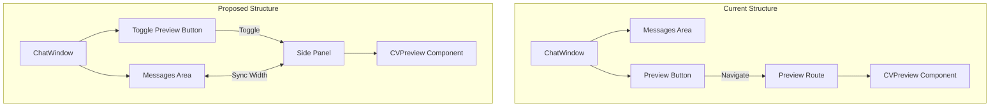

# CV Preview Integration Plan

## Current Structure vs Proposed Structure



## Implementation Plan

### 1. Layout Changes

- Add a resizable side panel to the ChatWindow component
- The side panel will contain the CVPreview component
- Main chat area will adjust its width when the preview panel is open
- Use CSS Grid for responsive layout management

### 2. Component Changes

- Remove the navigation to "/preview" from the preview button
- Add state to control the preview panel visibility
- Update the CVPreview component to fit within the side panel
- Add a toggle button to show/hide the preview panel

### 3. Responsive Behavior

- Desktop: Show preview panel side-by-side with chat
- Mobile: Preview panel should overlay the chat with a dismiss button
- Use existing useIsMobile hook for responsive behavior

### 4. Code Structure

```typescript
// Updated ChatWindow layout
<div className="grid grid-cols-[1fr,auto]">
  {/* Chat Area */}
  <div className="flex flex-col">
    {/* Existing chat content */}
  </div>

  {/* Preview Panel */}
  {showPreview && (
    <div className={cn(
      "border-l",
      isMobile ? "fixed inset-0 z-50 bg-background" : "w-[400px]"
    )}>
      <CVPreview {...cvData} />
    </div>
  )}
</div>
```

### 5. Technical Details

1. State Management:
   - Add `showPreview` state to ChatWindow
   - Connect to existing CV data stores

2. CSS Changes:
   - Add responsive grid layout
   - Add transition animations for panel
   - Ensure proper z-index management

3. Mobile Considerations:
   - Add overlay background
   - Add close button
   - Handle touch gestures

4. Performance:
   - Lazy load preview panel
   - Optimize re-renders
   - Cache CV data