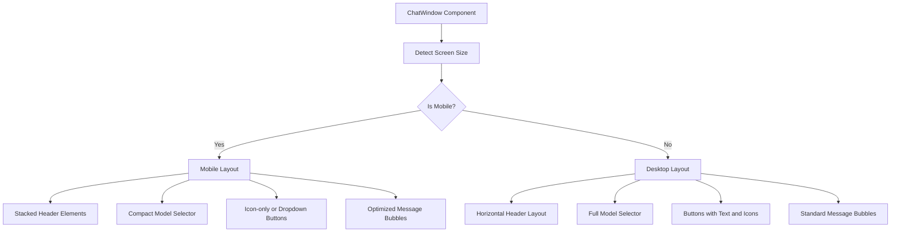

# Responsive Improvement Plan for CV Application

## 1. Analysis of Current Issues

### Chat Interface Header Issues
- The model selector and action buttons are arranged in a single row with fixed spacing
- On mobile screens, these elements overlap or get cut off due to insufficient space
- No responsive behavior to adapt the layout for smaller screens
- The `useIsMobile` hook is imported but not utilized effectively

## 2. Proposed Solutions

### A. Improve ChatWindow Header Responsiveness

1. **Reorganize Header Layout**
   - Implement a responsive layout that adapts to different screen sizes
   - On mobile screens, stack elements vertically or use a dropdown menu for actions
   - On larger screens, maintain the current horizontal layout

2. **Optimize Model Selector**
   - Make the model selector more compact on mobile screens
   - Consider using a dropdown button with icon instead of the full select element
   - Implement truncation for long model names

3. **Responsive Button Layout**
   - Use responsive classes to adjust button sizes and spacing on different screens
   - Consider using icon-only buttons on very small screens with tooltips
   - Group related actions in a dropdown menu on mobile

4. **Utilize the useIsMobile Hook**
   - Properly implement the useIsMobile hook to conditionally render different layouts
   - Use the hook to make intelligent decisions about UI elements based on screen size

### B. Implement Responsive Chat Message Layout

1. **Optimize Message Bubbles**
   - Ensure message bubbles adapt properly to screen width
   - Adjust maximum width percentages for different screen sizes
   - Ensure long messages wrap properly without breaking the layout

2. **Responsive Action Buttons in Messages**
   - Improve how action buttons display in message bubbles on small screens
   - Consider horizontal scrolling for multiple actions on mobile
   - Ensure touch targets are large enough for mobile users

### C. Improve Input Area Responsiveness

1. **Optimize Input Controls**
   - Ensure the text input and send button maintain proper proportions on all screens
   - Adjust padding and margins for better touch interaction on mobile
   - Ensure the auto-expanding textarea works well on mobile devices

## 3. Implementation Approach



## 4. Technical Implementation Details

1. **Use Tailwind's Responsive Classes**
   - Leverage Tailwind's responsive prefixes (sm:, md:, lg:) to apply different styles at different breakpoints
   - Example: `flex-col md:flex-row` to stack elements on mobile and place them side by side on larger screens

2. **Implement Conditional Rendering**
   - Use the useIsMobile hook to conditionally render different UI components
   - Example: Show simplified UI on mobile and full UI on desktop

3. **Optimize Element Sizing**
   - Use relative units and max-width constraints to ensure elements scale properly
   - Implement text truncation for long content on small screens

4. **Improve Touch Targets**
   - Ensure all interactive elements are at least 44x44px on mobile for better touch interaction
   - Add appropriate spacing between clickable elements

## 5. Testing Strategy

- Test on various device sizes (320px, 375px, 414px, 768px, 1024px, 1440px)
- Verify that all UI elements are accessible and usable on each screen size
- Ensure no content is cut off or overlapping
- Validate that touch interactions work well on mobile devices

## 6. Implementation Code Examples

### Example 1: Responsive Header in ChatWindow.tsx

```tsx
// Import the useIsMobile hook
import { useIsMobile } from "../hooks/use-mobile";

// Inside the ChatWindow component
const isMobile = useIsMobile();

// Responsive header implementation
return (
  <div className={cn("flex h-full flex-col", className)}>
    <div className="border-b">
      <div className="flex flex-col sm:flex-row sm:items-center sm:justify-end p-2 gap-2">
        {/* Model selector - more compact on mobile */}
        <div className="w-full sm:w-auto">
          <select
            value={selectedModel}
            onChange={(e) => setSelectedModel(e.target.value)}
            className="w-full sm:w-auto rounded-md border border-input bg-background px-3 py-2 text-sm ring-offset-background focus:outline-none focus:ring-2 focus:ring-ring focus:ring-offset-2"
          >
            {availableModels.map(model => (
              <option key={model.id} value={model.id}>
                {isMobile ? model.name.substring(0, 20) + '...' : model.name}
              </option>
            ))}
          </select>
        </div>
        
        {/* Action buttons - stack on mobile, row on desktop */}
        <div className="flex flex-row justify-end gap-2 mt-2 sm:mt-0">
          <Button 
            variant="outline" 
            size="sm"
            className="gap-1 sm:gap-2"
            onClick={handleClearChat}
          >
            <Trash2 size={16} />
            {!isMobile && "Limpiar Chat"}
          </Button>
          <Button 
            variant="outline" 
            size="sm"
            className="gap-1 sm:gap-2"
            onClick={() => navigate("/preview")}
          >
            <FileText size={16} />
            {!isMobile && "Previsualizar CV"}
          </Button>
        </div>
      </div>
    </div>
    
    {/* Rest of the component */}
  </div>
);
```

### Example 2: Responsive Message Bubbles

```tsx
// In ChatMessage.tsx
<div
  ref={messageRef}
  className={cn(
    "message-container mb-4 max-w-[95%] sm:max-w-[85%] md:max-w-[80%] animate-fade-in",
    isUser ? "ml-auto" : "mr-auto"
  )}
>
  {/* Message content */}
</div>
```

### Example 3: Responsive Action Buttons in Messages

```tsx
// For multiple action buttons in messages
<div className="flex flex-wrap gap-1 mt-2 overflow-x-auto pb-1">
  {actions.map((action, index) => (
    <ActionButton
      key={index}
      label={isMobile && action.label.length > 10 ? action.label.substring(0, 10) + '...' : action.label}
      onClick={action.action}
      variant="secondary"
      className="my-1 min-w-[44px] min-h-[44px]" // Ensure good touch target size
    />
  ))}
</div>